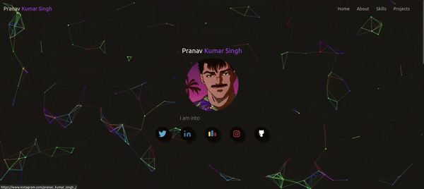

# My Portfolio website

This project is my Portfolio website. It is designed with React for frontend and Framer motion for Interactive UI.
## Features

- Responsive UI

## Technologies and Tools

- **React:** Utilized for building the user interface.
- **Vite:** Used for a faster and leaner development experience.
- **Tailwind CSS:** For styling and responsive design.
- **Framer:** A popular animation and motion library for React applications.

## Setup and Installation

To run this project locally, follow these steps:

1. Clone the repository:
   ```bash
   git clone <repository-url>
   ```
2. Install dependencies:
   ```bash
   npm install
   ```
3. Start the development server:
   ```bash
   npm run dev
   ```
   The application will be available at `http://localhost:5176`.

## Live Link

[Pranav-Kumar-Singh]((https://pranav-kumar-singh.netlify.app/))


## Preview

[Pranav Kumar Singh Portfolio Preview]((https://youtu.be/W1cegPIecds))


## My-Portfolio

 
